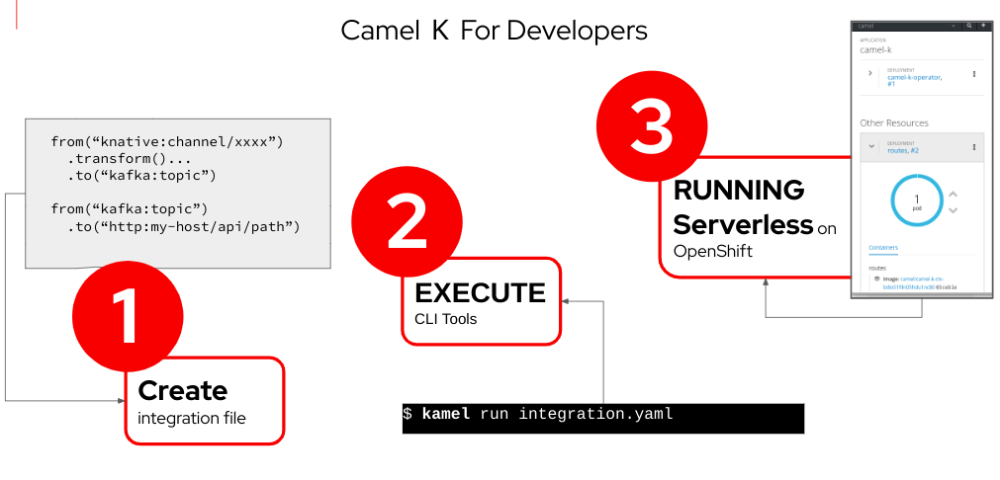
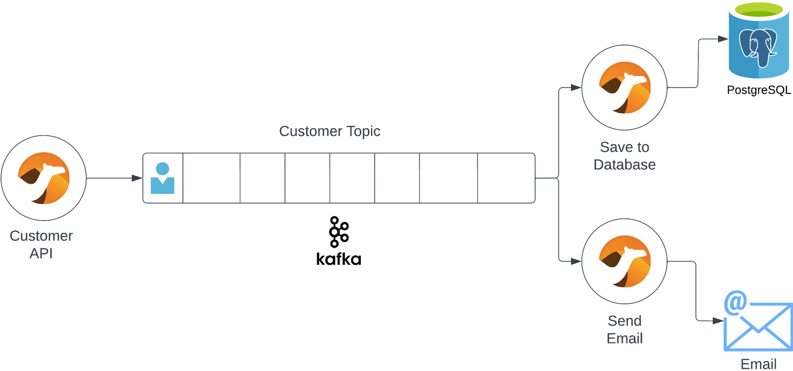

# Camel-K: Integrate Systems with Microservices

*By Robert Baumgartner, Red Hat Austria, August 2023 (OpenShift 4.13)*


Camel-K helps us integrate systems in an easy, simple, and cost-effective way. Do more with less.

**Do more with less.**

That’s the goal for everyone right now. But every company also has to integrate with multiple systems to get their job done.

**And that’s expensive.**

Integrations can be difficult to develop, complex to manage, and inefficient to run. It's the opposite of what you want in a recession

So if we’re trying to do more with less, integration is a great place to start.

## Why do we use Camel K?

[Camel K](https://camel.apache.org/camel-k/) is a lightweight integration framework built from **Apache Camel** that runs natively on Kubernetes and is specifically designed for serverless and microservice architectures. **It is an easy, simple, and cost-effective way to connect two systems.**

[Apache Camel]() is an open-source integration framework based on known Enterprise Integration Patterns.

Camel empowers you to define routing and mediation rules in a variety of domain-specific languages (DSL, such as Java, XML, Groovy, Kotlin, JavaScript, JShell and YAML). This means you get smart completion of routing rules in your IDE, whether in a Java or XML editor.

Apache Camel uses URIs to work directly with any kind of transport or messaging model such as HTTP, Kafka, JMS, JBI, SCA, MINA or CXF, as well as pluggable Components and Data Format options. Apache Camel is a small library with minimal dependencies for easy embedding in any Java application. Apache Camel lets you work with the same API regardless of which kind of transport is used — so learn the API once and you can interact with all the Components provided out-of-box.



Camel-K comes with over 150+ pre-built connectors for integrating anything from databases, message queues, or even Salesforce or Twitter.

But unlike regular integration platforms, Camel K is designed for Serverless. **We only pay for what we need.** This means we can save a lot of money when our integrations aren’t running.

## How do we use Camel K?

### What You’ll Need

- An OpenShift Cluster with admin rights, if the required operators are not already installed.
- [Kamel CLI](https://camel.apache.org/camel-k/1.12.x/cli/cli.html?ref=codelikethewind.org)
- [Knative CLI](https://knative.dev/docs/client/install-kn/?ref=codelikethewind.org#install-the-knative-cli)
- [hey load generator](https://github.com/rakyll/hey?ref=codelikethewind.org), hey is a tiny program that sends some load to a web application.

Many systems are usually involved when a new customer signs up. Using a few integrations, **we’ll create a customer sign-up flow** that saves their information to a database and sends them a welcome message.



## Step 1: Configure the Cluster Environment

Our environment includes Kafka, a PostgreSQL database, and of course, Camel K. So first, we’ll set up our environment.

If the required operators are already installed you can skip this task. Continue with *Create a new OpenShift project...*

This task has to be done as cluster admin.

In the config folder, some files will configure components in our environment. Here’s what these files will set up.

- **Camel K Operator**: adds Camel K functionality to OpenShift
- **Serverless Operator**: adds auto-scaling capabilities to our integrations
- **AMQ Streams Operator**: adds Kafka event stream functionality to OpenShift

```bash
$ oc create -f config/
subscription.operators.coreos.com/amq-streams-operator created
subscription.operators.coreos.com/red-hat-camel-k created
namespace/openshift-serverless created
operatorgroup.operators.coreos.com/serverless-operators created
subscription.operators.coreos.com/serverless-operator created
```

### Check to make sure the components are installed correctly.

```bash
$ oc get csv -n openshift-operators
NAME                             DISPLAY                      VERSION REPLACES                    PHASE
amqstreams.v2.4.0-1              AMQ Streams                  2.4.0-1 amqstreams.v2.4.0-0         Succeeded
red-hat-camel-k-operator.v1.10.1 Red Hat Integration-Camel K  1.10.1  red-hat-camel-k-v1.10.0     Succeeded
serverless-operator.v1.29.0      Red Hat OpenShift Serverless 1.29.0  serverless-operator.v1.28.0 Succeeded
```

You should see three operators in the state *Succeeded*. 

### Create a Knative Serving Instance

```bash
$ oc apply -f config-knative/
knativeserving.operator.knative.dev/knative-serving created
```

It may take a few seconds for the Knative Serving resources to be created. Verify the installation completes.

```bash
$ oc get knativeserving.operator.knative.dev/knative-serving -n knative-serving --template='{{range .status.conditions}}{{printf "%s=%s\n" .type .status}}{{end}}'
DependenciesInstalled=True
DeploymentsAvailable=True
InstallSucceeded=True
Ready=True
```

If the conditions have a status of Unknown or False, wait a few moments and then check again after you have confirmed that the resources have been created.

Check that the Knative Serving resources have been created:

```bash
$ oc get pods -n knative-serving
NAME                                                         READY   STATUS      RESTARTS   AGE
activator-6f7c69466-vq8xj                                    2/2     Running     0          38m
autoscaler-bf4864f96-rdvh9                                   2/2     Running     0          38m
autoscaler-hpa-7574f6d4d7-bjfpj                              2/2     Running     0          38m
controller-f9bfb74db-vbkhk                                   2/2     Running     0          38m
domain-mapping-84c999cd99-gzdcd                              2/2     Running     0          38m
domainmapping-webhook-dcfd4f84d-4wzgn                        2/2     Running     0          69s
storage-version-migration-serving-serving-1.8-1.29.0-q6vjc   0/1     Completed   0          38m
webhook-74bf8584b5-4685g                                     2/2     Running     0          38m
```

In this guide, Knative Serving is installed without high availability for saving resources. See "config-knative/serving.yaml".

### (Optional) Create User Workload Monitoring

Thanks to OpenShift monitoring (Prometheus) is already installed and available.
To enable user workload monitoring, his needs to be enabled by following these instructions:

```bash
$ oc create -f config-monitoring/
configmap/cluster-monitoring-config created
```

Check that the pods are running in the corresponding namespace.
```bash
$ oc get pod -n openshift-user-workload-monitoring 
NAME                                   READY   STATUS    RESTARTS   AGE
prometheus-operator-64dc995cf5-9x4hb   2/2     Running   0          28s
prometheus-user-workload-0             6/6     Running   0          20s
prometheus-user-workload-1             6/6     Running   0          20s
thanos-ruler-user-workload-0           4/4     Running   0          18s
thanos-ruler-user-workload-1           4/4     Running   0          18s
```

## Step 2: Configure the User Environment

### Create a new OpenShift project and configure the environment.

```bash
$ oc login -u <username> -p <password>
$ oc new-project camel-k
Now using project "camel-k" on server "https://api.<your-domain>:6443".

You can add applications to this project with the 'new-app' command. For example, try:

    oc new-app rails-postgresql-example

to build a new example application in Ruby. Or use kubectl to deploy a simple Kubernetes application:

    kubectl create deployment hello-node --image=registry.k8s.io/e2e-test-images/agnhost:2.43 -- /agnhost serve-hostname

```

### Create an IntegrationPlaform in the namespace

This is required because we want to configure our IntegrationPlatform later.

```bash
$ kamel install
OLM is available in the cluster
OLM resources are already available: skipping installation
Camel K installed in namespace camel-k via OLM subscription
```

### Create a Kafka Brocker and Topic 

- **A Kafka Broker**: servers to handle Kafka messaging
- **A Kafka Topic**: called `signups` - to send our new customers signups to Knative Serving

```bash
$ oc apply -f post-config/
kafka.kafka.strimzi.io/my-cluster created
kafkatopic.kafka.strimzi.io/signups created
```

### Create a PostgreSQL database.

```bash
$ oc new-app \
        -e POSTGRESQL_USER=camelk \
        -e POSTGRESQL_PASSWORD=camelk \
        -e POSTGRESQL_DATABASE=customerdb \
        postgresql
```

Create a customer table to hold that data. 

- Create a remote shell into the Postgres pod.
- Log in to the database. The password is *camelk*, as defined in the previous shell command.
- Create a customer table.
- Exit twice to get back to your terminal.

```bash
$ oc rsh deployment/postgresql

psql -U camelk -W customerdb

CREATE TABLE customer (
    id SERIAL PRIMARY KEY,
    firstName varchar(255),
    lastName varchar(255),
    email varchar(255)
    );

exit
exit
```

## Step 3: Create the Customer API

We’ll create a customer signup API. When this endpoint gets hit, it’ll place new user data onto the Kafka topic we created.

In our project code, open src/CustomerAPI.java.

Routes help us define integration between a source (from) and a destination (to).

Inside the configure method, a simple rest API route is available.

This automatically exposes a REST API with an endpoint called *newCustomer*. It'll take in a JSON dictionary and send it to another route called *sendToKafka*.

After our REST route, a route called *sendToKafka* is available.

```java
import org.apache.camel.builder.RouteBuilder;

public class CustomerAPI extends RouteBuilder {

    @Override
    public void configure() throws Exception {
        
        rest("/")
            .post("/newCustomer")
                .consumes("application/json")
                .to("direct:sendToKafka");
                
        from("direct:sendToKafka")
                .log("${body}")
                .log("Sending message to kafka")
                .to("kafka:signups?brokers=my-cluster-kafka-bootstrap:9092");
    }
```

This route takes the message from *sendToKafka*, logs it, and forwards it to our Kafka broker. The Kafka Camel component makes it easy to communicate with Kafka.

Open the project directory in your terminal and **run the integration**.

```bash
$ kamel run \
	--trait knative-service.enabled=true \
	--trait knative-service.autoscaling-target=10 \
	src/CustomerAPI.java --dev

No IntegrationPlatform resource in camel-k namespace
Unable to verify existence of operator id [camel-k] due to lack of user privileges
Integration "customer-api" created
Progress: integration "customer-api" in phase Initialization
Progress: integration "customer-api" in phase Building Kit
Condition "IntegrationPlatformAvailable" is "True" for Integration customer-api: openshift-operators/camel-k
Integration "customer-api" in phase "Initialization"
Integration "customer-api" in phase "Building Kit"
Condition "IntegrationKitAvailable" is "False" for Integration customer-api: creating a new integration kit
Integration Kit "openshift-operators/kit-cj1p8blit6d27k7gch00", created by Integration "customer-api", changed phase to "Build Submitted"
Build "openshift-operators/kit-cj1p8blit6d27k7gch00", created by Integration "customer-api", changed phase to "Scheduling"
Build "openshift-operators/kit-cj1p8blit6d27k7gch00", created by Integration "customer-api", changed phase to "Pending"
Build "openshift-operators/kit-cj1p8blit6d27k7gch00", created by Integration "customer-api", changed phase to "Running"
Integration Kit "openshift-operators/kit-cj1p8blit6d27k7gch00", created by Integration "customer-api", changed phase to "Build Running"
Progress: integration "customer-api" in phase Deploying
Progress: integration "customer-api" in phase Running
...
```

The two *traits* tell our integration to run as a Knative Service **and automatically add autoscaling to our integration**. We also set the maximum target number of concurrent requests to 10.

You should see the integration running message in your terminal.

*Integration "customer-api" in phase "Running"*

## Step 4: Create the Database Integration

We’ve created an API that takes in customer data and forwards it to the Kafka Topic. 
Now we’ll grab that message off our topic and save the user information.

In our project code, open src/SaveCustomer.java and see the database integration.

```java
// camel-k: dependency=camel:jdbc
// camel-k: dependency=mvn:io.quarkus:quarkus-jdbc-postgresql

import org.apache.camel.builder.RouteBuilder;

public class SaveCustomer extends RouteBuilder {
    @Override
    public void configure() throws Exception {
        from("kafka:signups?brokers=my-cluster-kafka-bootstrap:9092")
            .unmarshal().json()
            .log("Saving new customer: ${body[firstname]} ${body[lastname]} with email: ${body[email]}")
            .setBody(simple("INSERT INTO customer (firstname, lastname, email) VALUES ('${body[firstname]}', '${body[lastname]}', '${body[email]}')"))
            .to("jdbc:default")
            .to("log:info");
    }
}
```

This route takes the message from Kafka, converts it to JSON, logs a message, and saves a customer to the database. The JDBC connector makes it easy to connect to the database.

In another terminal, **run the integration** with the following command.

```bash
$ DB_URL=jdbc:postgresql://postgresql:5432/customerdb

$ kamel run \
	-p quarkus.datasource.db-kind=postgresql \
	-p quarkus.datasource.jdbc.url=$DB_URL \
	-p quarkus.datasource.username=camelk \
	-p quarkus.datasource.password=camelk \
	src/SaveCustomer.java --dev
```

We’re passing in our database connection string as properties. For production, **you should create this as a secret** and reference it.

Wait until you see the integration running.

## Step 5: Create the Email Integration
We’ll create an integration to send our new customers a welcome email.

In the real world, we’d use the mail component or a mail REST API. But for our purposes, this will just log the email to the console.

In our project code, open src/SendEmail.java and see the simple code.

```java
import org.apache.camel.builder.RouteBuilder;

public class SendEmail extends RouteBuilder {
    @Override
    public void configure() throws Exception {

        from("kafka:signups?brokers=my-cluster-kafka-bootstrap:9092")
            .unmarshal().json()
            .log("Sending message to new customer: ${body[firstname]}\n")
            .log("To:${body[email]}\nSubject: Welcome to NewCompony\nHello ${body[firstname]}, we're so glad you joined us here at NewCompany ");
    }
}
```

This route consumes the Kafka message, converts it to an object, and creates a welcome email from the customer attributes.

In another terminal, **run our integration**.

```bash
$ kamel run src/SendEmail.java
No IntegrationPlatform resource in camel-k namespace
Unable to verify existence of operator id [camel-k] due to lack of user privileges
Integration "send-email" created
```

Wait until you see the integration running.

## Step 6: Check all integrations are running

```bash
$ kamel get
kamel get
No IntegrationPlatform resource in camel-k namespace
NAME		    PHASE	KIT
customer-api	Running	openshift-operators/kit-cj4janms21n6qgh50f4g
save-customer	Running	openshift-operators/kit-cj4janms21n6qgh50f50
send-email	    Running	openshift-operators/kit-cj4janms21n6qgh50f5g

$ oc get integration
NAME            PHASE     KIT                        REPLICAS
customer-api    Running   kit-cj4janms21n6qgh50f4g   0
save-customer   Running   kit-cj4janms21n6qgh50f50   1
send-email      Running   kit-cj4janms21n6qgh50f5g   1
```

For the Customer API, the replicas are set to 0 because we have designed this service as a Knative service. Therefore the replication is 0, so no pod is running.

## Step 7: Generate Load

- Get the route URL for our Customer API.
- Send one request to our API.

```bash
$ URL=`kn service describe customer-api -o url`

$ curl -X POST -d '{"firstname": "Max", "lastname": "Mustermann", "email": "mm@example.com"}' \
       -H 'Content-Type: application/json' "$URL/newCustomer"
{"firstname": "Max", "lastname": "Mustermann", "email": "mm@example.com"}
```

You should see this in your Customer API terminal.

```
(executor-thread-0) {"firstname": "Max", "lastname": "Mustermann", "email": "mm@example.com"}
```

On the second terminal:

```
INSERT INTO customer (firstname, lastname, email) VALUES ('Max', 'Mustermann', 'mm@example.com')
```

Look at the log of the send-mail integration.

```bash
$ oc logs deployment/send-email | tail

2023-07-28 10:46:38,442 INFO  [route1] (Camel (camel-1) thread #1 - KafkaConsumer[signups]) To:mm@example.com
Subject: Welcome to NewCompany
Hello Max, we are so glad you joined us here at NewCompany
```

Generate some load to our Customer API service.

```bash
$ URL=`kn service describe customer-api -o url`

$ hey -c 50 -n 3000 -t 30 -m POST -d '{"firstname": "Max", "lastname": "Mustermann", "email": "mm@example.com"}' -T "application/json" "$URL/newCustomer"
...
```

This sends 3000 messages with up to 50 requests concurrently to our Customer API.

You should see more customer-api pods starting. As more requests come in, **our service is scaling to meet the demand**.

Open in another terminal the following watch to see the scale of the Customer API.

```bash
$ watch oc get pod -l camel.apache.org/integration=customer-api

NAME                                             READY   STATUS    RESTARTS   AGE
customer-api-00001-deployment-6ddf9cd88b-jwvlk   2/2     Running   0          83s
customer-api-00001-deployment-6ddf9cd88b-mz5vc   2/2     Running   0          37s
customer-api-00001-deployment-6ddf9cd88b-q7q4l   2/2     Running   0          39s
customer-api-00001-deployment-6ddf9cd88b-qfwsf   2/2     Running   0          39s
customer-api-00001-deployment-6ddf9cd88b-vks28   2/2     Running   0          41s
```

When the load finishes, you should see the service scale back to zero. It’s a feature of Knative. 
This helps to save money when our integrations aren’t running.

Press CTRL+C to exit the watch.

### Step 8: Check the records in the database.

```bash
$ oc rsh deployment/postgresql

psql -U camelk -W customerdb -c "select count(*) from customer"
 count 
-------
 3002
(1 row)

exit
```

### Bonus 1: Add Obersvabilty / Monitoring to Camel K

The Prometheus trait configures a Prometheus-compatible endpoint. It also creates a PodMonitor resource, so that the endpoint can be scraped automatically when user workload monitoring is enabled.

The metrics are exposed using MicroProfile Metrics.

Add "--trait prometheus.enabled=true"

```bash
$ kamel run \
	--trait knative-service.enabled=true \
	--trait knative-service.autoscaling-target=10 \
    --trait prometheus.enabled=true \
	src/CustomerAPI.java
```

If you are interested in which metrics are exposed, you can get a list from the service.

```bash
URL=`kn service describe customer-api -o url`
$ curl $URL/q/metrics
# HELP application_camel_context_exchanges_completed_total The total number of completed exchanges for a route or Camel Context
# TYPE application_camel_context_exchanges_completed_total counter
application_camel_context_exchanges_completed_total{camelContext="camel-1"} 1.0
# HELP application_camel_context_exchanges_failed_total The total number of failed exchanges for a route or Camel Context
# TYPE application_camel_context_exchanges_failed_total counter
application_camel_context_exchanges_failed_total{camelContext="camel-1"} 0.0
# HELP application_camel_context_exchanges_inflight_count The count of exchanges inflight for a route or Camel Context
# TYPE application_camel_context_exchanges_inflight_count gauge
...
```

In the Openshift console, you will find in the developer view under *Observer* the dashboard, which gives you information about CPU, memory and IO.


On the tab *Metrics* you can enter *customer query* to expose metrics the values. 
e.g. "application_camel_route_exchanges_total{camelContext="camel-1",routeId="route1"} "


### Bonus 2: Configure Camel K to build faster

Camel K uses Apache Maven to build the integration kits and their related containers. The Apache Maven settings for Camel K are stored in the ConfigMap camel-k-maven-settings. 

One of the ways to make the build faster is by using a maven repository manager such as Sonatype Nexus. The repository manager helps in caching the maven artifacts from remote repositories and serves them locally the subsequent times they are asked to be downloaded.

- Create a local Nexus instance
- Create a ConfigMap, which points to the Nexus instance. If you have a Nexus already running change the URL to "http://<service>.<namespace>.svc:8081" or your external URL.
- Update the IntegrationPlatform to use the new ConfigMap.


```bash
$ oc create -f nexus/nexus.yaml -n openshift-operators
service/nexus created
deployment.apps/nexus created

$ oc create configmap camel-k-maven-settings \
  --from-file=settings.xml="nexus/settings.xml" -n openshift-operators
configmap camel-k-maven-settings created

$ kamel install --force --maven-settings="configmap:camel-k-maven-settings/settings.xml" --wait
```

When you run Camel K with a global IntegraionPlatform the cluster-admin has to patch the IntegrationPlaform in the namespace *openshift-operator*.

```bash
$ oc patch integrationplatforms camel-k -n openshift-operators -p '{"spec":{"build":{"maven":{"settings":{"configMapKeyRef":{"key":"settings.xml","name":"camel-k-maven-settings"}}}}}}' --type=merge
integrationplatform.camel.apache.org/camel-k patched
```

## Best Practices

When creating integrations with Camel K, it’s best to keep them small. This makes it easy to scale pieces separately. 
It’s the same single responsibility principle we use in creating microservices.

## Summary

Camel K helps us to do more with less. It is an easy, simple, and cost-effective way to connect two or more systems. 
We can install Camel K on any Kubernetes cluster and create small integrations that are easy to deploy and scale.

## Remove this Demo

```shell
$ oc delete project camel-k
```

## Project Code & Links

- Camel K Serverless Demo (https://www.youtube.com/watch?v=hlUzLC71nAM&t=1725s&ab_channel=RedHatDeveloper&ref=codelikethewind.org)
- Camel K Official Site (https://camel.apache.org/camel-k/1.12.x/index.html?ref=codelikethewind.org)
- Knative Tutorial with Camel K (https://redhat-developer-demos.github.io/knative-tutorial/knative-tutorial/camelk/index.html)


This document: 

**[Github: rbaumgar/otelcol-demo-app](https://github.com/rbaumgar/otelcol-demo-app/blob/master/ServicePerformanceMonitoring.md)**